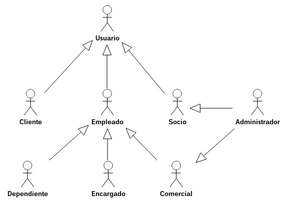
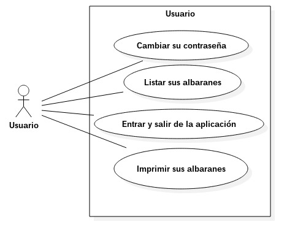
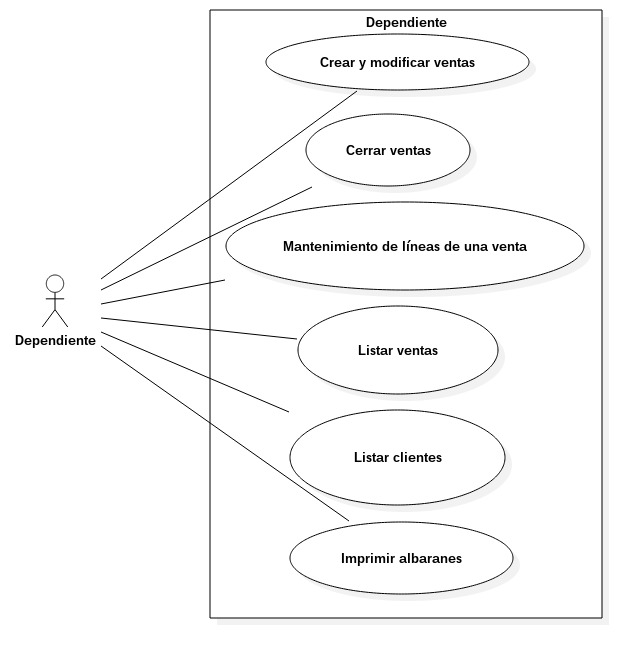
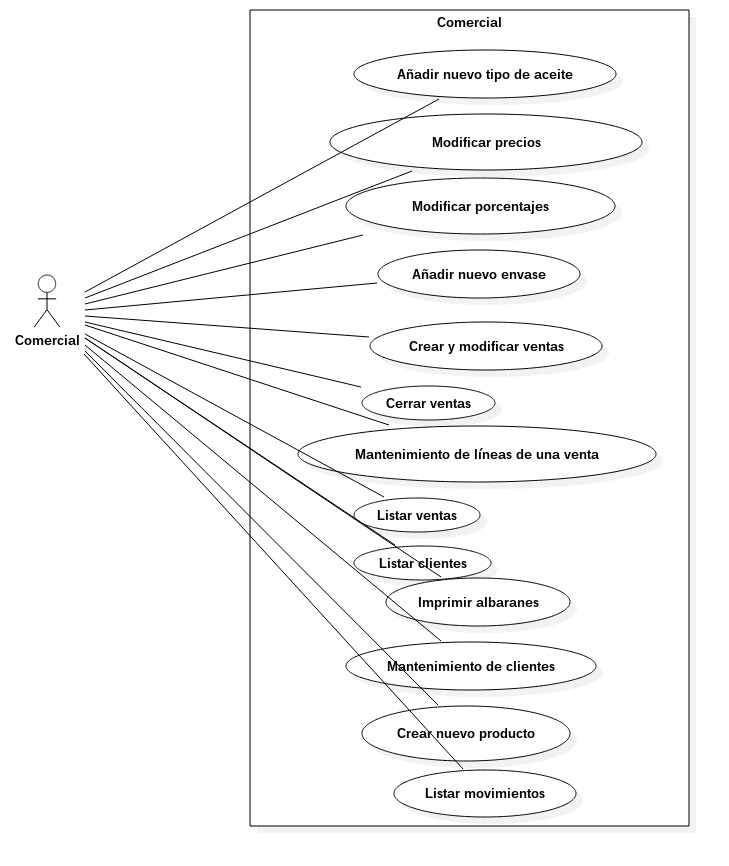
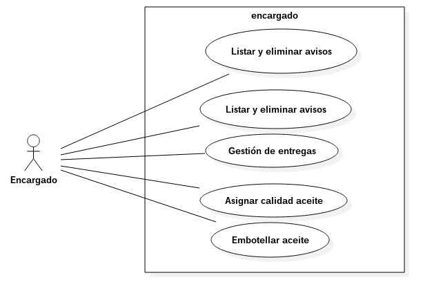
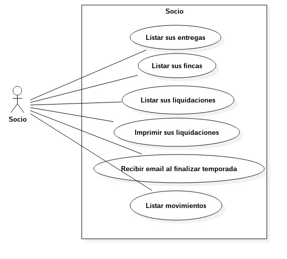
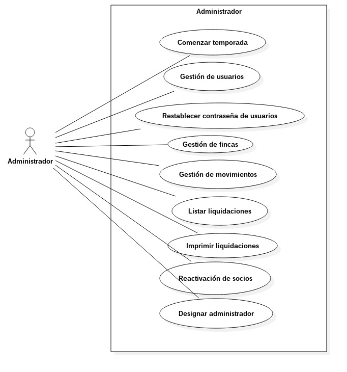
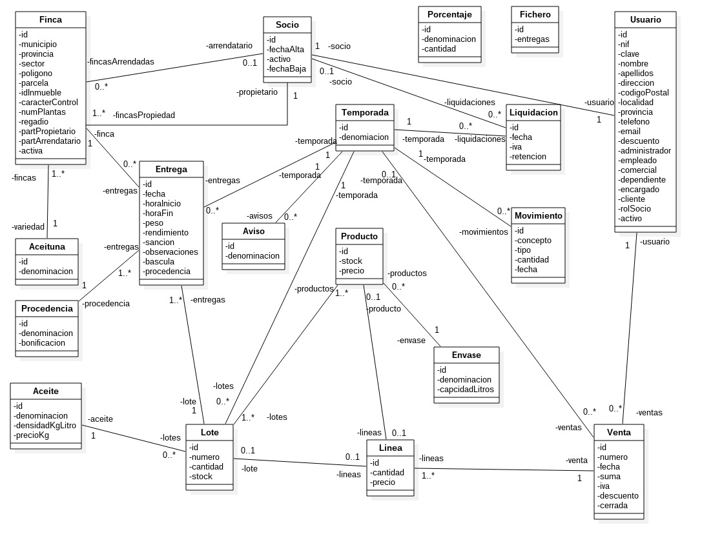
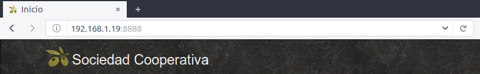

## Índice
- [1. Introducción](#introduccion) 						 
- [2. Objetivos](#objetivos)  												  
- [3. Tecnologías escogidas y justificación](#tecnologias_escogidas)  						       	   	  
  - [3.1. Tecnologías escogidas y justificación](#tecnologias_escogidas_2)  			          	     		  
  - [3.2. Motor de bases de datos](#bases_datos)   						    		  
  - [3.3. Frameworks seleccionados](#frameworks_seleccionados)  						    		  
- [4. Diseño de la aplicación](#diseno)  										  
  - [4.1. Casos de uso](#casos_uso) 								     	  
  - [4.2. Modelo de dominio](#modelo)  						    	  						  
- [5. Arquitectura de la aplicación](#arquitectura)   						         	   		 
  - [5.1. Estructura del proyecto](#estructura)  						         		 
  - [5.2. Recursos externos](#recursos)  							        		  
- [6. Manual de despliegue](#despliegue)   										 
  - [6.1. Requisitos hardware y software aplicables](#requisitos)  			   		  
  - [6.2. Instrucciones de despliegue en Linux](#despliegue_linux)   			 		    	 
  - [6.3. Instrucciones de despliegue en Windows, Mac y en un proveedor en la nube](#despliegue_resto)   		  									       
  - [6.4. Configuración inicial](#configuracion) 
						     		
## 1. Introducción 	
Este proyecto consiste en el desarrollo de una aplicación web destinada a la sociedad cooperativa “Sociedad Cooperativa” cuyo trabajo está orientado a la producción de aceite de oliva. La aplicación consta de varias interfaces principales, cuyo aspecto y funcionalidad dependerán del rol del usuario registrado. 

La aplicación se desarrolla en web, de forma que los usuarios podrán acceder a ella sin necesidad de instalar software en su equipo informático y con el único requisito de tener un navegador web y una conexión a internet. Algo que a día del desarrollo de esta aplicación está muy extendido en nuestro país. 										  
## 2. Objetivos 

La razón de la elaboración de este proyecto viene dada por la necesidad que tienen los agentes intervinientes en la elaboración de aceite de estar informados en todo momento y en tiempo real de los datos propios de la actividad principal de constantes. Con la introducción de esta aplicación en la empresa se obtendrán múltiples beneficios tales como una mayor facilidad para el almacenamiento y gestión de los datos tanto de los socios como de los empleados, una mayor posibilidad de dar a conocer sus servicios, más comodidad para los usuarios, etc.												 

## 3. Tecnologías escogidas y justificación 
La aplicación dará servicio a distintos tipos distintos de usuarios:
- `Anónimo`: Podrán acceder a la página principal de la aplicación dentro de la cuál podrán conocer los servicios ofrecidos por la empresa, así como otros datos referentes a la misma.
- `Usuario:` Podrán acceder mediante una autenticación a sus datos de carácter personal y podrán interactuar con la misma dependiendo del rol específico de cada uno. Los usuarios podrán ser:
  - `Socio:` Cada uno de ellos tiene una participación en los beneficios de la empresa. Son los que descargan la aceituna en la almazara para su proceso de elaboración. Uno de ellos es el administrador de la aplicación.
    - `Administrador:` Es el encargado del mantenimiento principal de la aplicación, gestión de socios, restablecimiento de contraseñas… A su vez es también comercial.
  - `Empleado:` No todos los empleados de la empresa tienen un rol específico en la aplicación. Por ejemplo, un peón de mantenimiento no necesita usar la aplicación para el desarrollo de su trabajo. Los que si la necesitan son:
    - `Comercial:` Encargado de la gestión de ventas, clientes, precios y otros aspectos relacionados con la economía de la empresa. El administrador tiene por defecto el rol de comercial.
    - `Dependiente:` Es el encargado de realizar ventas, generalmente en la tienda de la almazara, aunque esta aplicación no le restringe el acceso a ningún tipo de clientes ni ventas.
    - `Encargado:` Es el responsable de almazara y como tal el encargado de insertar los datos derivados del trabajo en la misma (descargas de aceituna, análisis de aceite, stock de productos…).
  - `Cliente:` Todos los usuarios pueden realizar compras de aceite. Pero existen usuarios externos a la almazara que no son ni socios ni empleados. Estos son clientes.						       	   	  

### 3.1. Tecnologías escogidas y justificación 
La aplicación se desarrolla en su mayor parte usando lenguaje de servidor PHP. No obstante, existen partes de la misma realizadas en lenguaje cliente Javascript y su biblioteca multiplataforma `Jquery.` 			          	     		 

Cabe mencionar que todo el software utilizado es libre, con lo que la empresa tendrá un considerable ahorro en concepto de licencias. El software seleccionado no lo ha sido sólo por  gratuito, sino porque además es unas de las tecnologías más utilizada en la actualidad en el desarrollo de aplicaciones web debido a su fiabilidad y a su versatilidad. 

Pero lo más importante a destacar es que el lenguaje de programación escogido va asociado al framework. La selección del framework se desarrolla en el punto [3.3](#frameworks_seleccionados)

### 3.2. Motor de bases de datos 
El motor de bases de datos usado es `MySql`. Las razones de su elección son las siguientes:
- Su adquisición es gratuita, lo que permite reducción de costes para el cliente.
- Es multiplataforma para Windows, Linux y Mac (los sistemas operativos más extendidos) con lo cual se podrá disponer él en cualquiera de estos.
- Es un motor muy extendido en la comunidad de desarrolladores, con lo que conseguir ayuda es muy sencillo.
- La labor de mantenimiento de una base de datos MySql es muy fácil debido a que presenta menos funciones frente a otros sistemas gestores. Esto, aunque pueda parecer una desventaja, tiene a su favor que el mantenimiento de la aplicación lo puede llevar el propio desarrollador, sin tener que recurrir a un administrador de bases de datos.
- Es escalable, lo cual nos da una ventaja con vistas al futuro. 						    		  

### 3.3. Frameworks seleccionados
El framework usado es `Symfony3.2.4`. Las razones de su elección son las siguiente:
- Es un framework gratuito.
- Lleva muy bien a la práctica el concepto Modelo-Vista-Controlador, lo cual es muy recomendable para el mantenimiento de aplicaciones.
- Está construido en lenguaje PHP, lo cual nos da una ventaja en el sentido de que este lenguaje es de los más extendidos en el mundo actualmente.
- La comunidad de desarrolladores Symfony es muy amplia. Como consecuencia de esto encontraremos infinidad de módulos reutilizables ya probados que podemos añadir a nuestro código de forma sencilla y que nos ahorrará es tener que crearlos y probarlos nosotros mismos.
- La ayuda de Symfony es muy buena e intuitiva.
- Los módulos existentes están muy estandarizados desde el punto de vista del código, con lo que estamos facilitando la interoperatividad.
- Buena comunicación entre el back-end y el front-end.
- Organiza las funcionalidades en paquetes o Bundles. Estos, si no vienen con el core pueden instalarse y podremos aprovechar su funcionalidad.
- El core de Symfony se basa en la integración de cuatro productos muy potentes ya existentes en el mercado:
  - `Twig:`  Es el gestor de plantillas html. Resuelve muy bien la separación entre las mismas y los controladores. Permite herencia y bloques html, lo que permite la no repetición de código innecesario.
  - `Doctrine:` Es un ORM (Object Relational Mapping) consistente en la equivalencia entre tablas de la base de datos y entidades. Esto permite al desarrollador olvidarse del lenguaje SQL y centrarse en su aplicación.
  - `Swiftmailer:` Es una librería para el envío de correos electrónicos. Permite usar varios transporters como SMTP o GMAIL.
  - `Monolog:` Es una librería para el registro de la actividad de una aplicación en ficheros.
						    		  
## 4. Diseño de la aplicación 	
									  
### 4.1. Casos de uso 

									     	  						    	 
### 4.2. Modelo de dominio 			

					   	 
## 5. Arquitectura de la aplicación  	
					         	   		  
### 5.1. Estructura del proyecto 
La estructura de la aplicación es la típica de un proyecto Symfony3. Las principales carpetas son:
- `app`: contiene la configuración de la aplicación, vistas y traducciones
  - `Resources`
    - `translations`: contiene los archivos `yml` de traducciones
    - `views`: contiene las distintas plantillas Twig organizadas en subcarpetas
  - `config`: contiene los archivos de configuración de la aplicación
- `bin`: contiene los archivos referentes a los comandos ejecutables desde la terminal.
- `src`: contiene el código fuente de la aplicación
  - `AppBundle`
    - `Controller`: contiene los controladores que dan funcionalidad a la aplicación.
    - `DataFixtures`: contiene los ficheros donde se definen los datos de inicio de la aplicación.
    - `Entity`: contiene los distintos ficheros donde se definen las entidades ORM.
    - `EventListener`: contiene los escuchadores de eventos.
    - `Form`: contiene las clases correspondientes a los formularios.
    - `Repository`: contiene las clases que albergan todas las acciones de consulta en base de datos.
    - `Service`: contiene el código de los servicios creados para esta aplicación.
- `tests`: contiene los controladores de tests.
- `var`: contiene los archivos de caché, logs, sesión…
- `vendor`: contiene el core de Symfony y las librerías externas.
- `web`: contiene todos los ficheros necesarios para la web como hojas de estilos, imágenes...
  - `bootstrap`: contiene todos los ficheros de Bootstrap.
  - `font-awesome`: contiene todos los ficheros de los iconos Font Awesome.
  - `images`: contiene todas las imágenes usadas en la aplicación.
  - `squery`: contiene todos los ficheros de Jquery.
  - `script`: contiene todos los ficheros Javascript usados en la aplicación.
  - `styles`: contiene todas las hojas de estilos de la aplicación.
  - `uploads`: contiene todos los ficheros subidos a la aplicación.	
					         		  
### 5.2. Recursos externos 
En esta aplicación se han usado diversos recursos externos, es decir, librerías y código no escrito por el desarrollador de esta aplicación. Los recursos externos usados son:
- `Bootstrap`: para el aspecto visual de la aplicación.
- `Font Awesome`: iconos para los distintos elementos html.
- `Jquery`: librería de Javascript.
- `FixturesBundle`: bundle de Symfony para la introducción de registros en la base de datos. En este caso, se usa para tener datos iniciales en la aplicación.
- `LiuggioExcelBundle`: bundle de Symfony para la lectura de datos en ficheros xls.
- `KnpPaginatorBundle`: bundle de Symfony para la paginación y ordenación de tablas.
- `MpdfBundle`: bundle de Symfony para generar ficheros formato pdf desde código html.
							        		 
## 6. Manual de despliegue
 										 
### 6.1. Requisitos hardware y software aplicables 	
- Hardware:
  - 2.00 GB de RAM.
  - 3.00 GB de espacio libre en disco duro.

- Navegadores soportados en móviles ([1](#1)) 
  
    |         | Chrome | Firefox | Safari |
    | :------ |:------:| :-----: | :----: |
    | Android | X      | X       | -      |
    | iOS     | X      | X       | X      |
    

  - Navegadores soportados en Pc ([2](#2))
  
    |         | Chrome | Firefox | Opera | Safari |
    | :------ |:------:| :-----: | :---: | :----: |
    | Mac     | X      | X       | X     | X      |
    | Windows | X      | X       | X     | -      |
    | Linux   | X      | X       | X     | -      |

	   		  
### 6.2. Instrucciones de despliegue en Linux  	
Esta aplicación se despliega mediante Docker (contenedor). Este sistema usa el kernel de Linux, así que no tendremos ningún problema en desplegarla en este sistema operativo.
 
Lo primero que debemos hacer es instalar en el equipo servidor Docker   (https://store.docker.com/search?type=edition&offering=community) y Docker Compose (https://docs.docker.com/compose/install/). En la carpeta de despliegue tenemos tres ficheros y una carpeta que albergará la aplicación sin la carpeta vendor. Los ficheros son:

__Dockerfile__

    FROM php:7.0.15-apache

    RUN sed -i 's!/var/www/html!/var/www/proyecto/web!g' /etc/apache2/sites-available/000-default.conf

    RUN curl -S https://getcomposer.org/installer | php -- --install-dir=/usr/local/bin --filename=composer

    RUN apt-get update && apt-get install unzip

    RUN docker-php-ext-install pdo pdo_mysql

    COPY 2016-2017-daw-proyecto-dhurtadorosales /var/www/proyecto/

    RUN a2enmod rewrite

    WORKDIR /var/www/proyecto

    RUN composer install 

    RUN chown -R www-data:www-data /var/www/proyecto
__docker-compose.yml__

    version: '2'
    services:
      web:
      build: .
      image: dhurtadorosales/2016-2017-daw-proyecto-dhurtadorosales
      ports:
        - "8888:80"
      restart: always
      depends_on:
        - bd
    bd:
      image: "mysql:5.7"
      environment:
        - MYSQL_DATABASE=cooperativa
        - MYSQL_USER=root
        - MYSQL_PASSWORD=diego
        - MYSQL_ROOT_PASSWORD=diego
      volumes:
        - db_data:/var/lib/mysql
    volumes:
    db_data:		 		    	    		  									       
__dockerignore__ (fichero oculto)

    2016-2017-daw-proyecto-dhurtadorosales/.git
Para desplegar la aplicación debemos irnos a la carpeta 
de la aplicación y dentro de ella nos vamos al directorio 
`app/config`. Copiamos el fichero `parameters.yml.dist`
 y lo pegamos en la misma ubicación como `parameters.yml`. 
 Abrimos este fichero y cambiamos los siguientes parámetros:

    database_password: la contraseña que se tenga en Mysql
    mailer_user: cooperativaficticia@gmail.com
    mailer_password: cooperativaficticia.
Una vez hecho esto ejecutamos los siguientes comandos

    docker-compose up -d
Ejecuta el despliegue

    docker-compose run web /usr/local/bin/php /var/www/proyecto/bin/console doctrine:schema:create
Crea el esquema de la base de datos

    docker-compose run web /usr/local/bin/php /var/www/proyecto/bin/console doctrine:fixtures:load
Introduce los datos iniciales a la base de datos

En ocasiones, puede que tengamos error al crear la base de datos, debido a que esta ya existe. En cualquier caso se recomienda seguir los siguientes pasos:

    docker-compose run web /usr/local/bin/php /var/www/proyecto/bin/console doctrine:database:drop –force
Borra la base de datos

    docker ps
Lista los contenedores existentes. Es necesario para ver el id de cada contenedor

    docker rm -f <identificador o nombre>
Borrar el contenedor. Hay que hacerlo uno a uno con todos los de nuestra aplicación.

    docker rm -f $(docker ps -a -q)
Borra todos los contenedores. ¡Cuidado!, también los de otras aplicaciones.

    docker-compose up -d
Volvemos a ejecutar el despliegue

    docker-compose run web /usr/local/bin/php /var/www/proyecto/bin/console doctrine:database:create
Creamos la base de datos

    docker-compose run web /usr/local/bin/php /var/www/proyecto/bin/console doctrine:schema:create
Crea el esquema de la base de datos

    docker-compose run web /usr/local/bin/php /var/www/proyecto/bin/console doctrine:fixtures:load
Introduce los datos iniciales a la base de datos

Puede que tengamos problemas y queramos empezar de 0. Para ello los siguientes comandos son útiles:

    docker image rm <identificador o nombre>
Borra una imagen. ¡Cuidado!, antes hay que borrar su contenedor.

    docker image rm -f $(docker image ls -q)
Borra todas las imágenes. ¡Cuidado!, incluyendo las de otras aplicaciones. Y para ello no puede existir ningún contenedor.

    docker-compose down
Para el servicio.

    docker exec -it <identificador contenedor Mysql> mysql -uroot -p
Accede a la base de datos Mysql. En ocasiones puede ser útil para hacer comprobaciones.

De esta forma ya tenemos nuestra aplicación desplegada. Sólo queda conectarse al servidor desde otro equipo que esté en la misma red. Para ello abrimos un navegador y en la barra de navegación escribimos:

    <dirección ip del servidor>:8888

### 6.3. Instrucciones de despliegue en Windows, Mac y en un proveedor en la nube
Como se ha dicho dicho antes, Docker usa el kernel de Linux. De forma que, si queremos
que nuestro servidor web tenga un sistema operativo distinto de Linux o en un proveedor
en la nube, bastará con crear máquinas virtuales con Linux. En estas máquinas se
instalará Docker y se ejecutarán los comandos necesarios como se ha explicado
anteriormente.

### 6.4. Configuración inicial 
Esta aplicación tiene unos datos de inicio que son necesarios para que ciertas acciones
se puedan llevar a cabo (por ejemplo, autenticarse en la aplicación). Estos datos son:
- `Aceites`: Los distintos tipos de aceite que la empresa tiene previsto producir.
- `Aceitunas`: Las distintas variedades de aceituna existentes por la zona.
- `Socios`: La sociedad comienza con tres socios iniciales. Uno de ellos será el
administrador.
- `Fincas`: Las fincas que aporta cada socio.
- `Usuarios`: Alberga a los socios anteriormente citados, empleados de la empresa y
una lista de varios clientes que los socios con los que los socios ya han pactado la
compraventa de sus producto.
- `Procedencias`: En principio la aceituna se separará según proceda del suelo o de
vuelo (árbol).
- `Porcentajes`: Se definen los porcentajes de cálculo iniciales y vigentes (iva,
retención...).
- `Envases`: Se definen los distintos tipos de envase iniciales que albergarán el aceite.
- `Productos`: Al mismo tiempo, se asociará cada envase con un aceite creando un
producto.
- `Lotes auxiliares`: Por estructura de la aplicación, cada aceite debe proceder de un
lote. De forma que si definimos aceites, se deben definir lotes. Se define un lote
auxilar por cada tipo de aceite.
- `Temporada auxiliar`: Lo mismo ocurre con la temporada. Cada lote debe estar
asociado a una temporada. De este modo se crea una temporada auxiliar 00/00 y
los lotes auxiliares pertenecen a ella		

#### Notas

1: También Windows Phone 8

2: También Internet Explorer 9 o superior					     		  